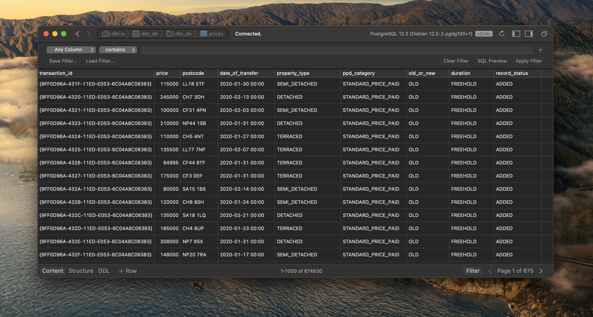

# dbt-postgres-demo

## Introduction

I've thrown a quick demo together to help me learn about [dbt](https://www.getdbt.com/) with a Postgres database.

> With very little effort we've cleaned up this price data!

The demo:
1. Starts a database (postgres)
1. Creates tables and imports a dataset
1. Sets up a DBT project and profile
1. Creates relevant models/views

:warning: **As this is a demo, it's not fit for production use.** I've deliberately put the `dbt-profiles` and `database.env` inside this repo to make it easy for a quickstart. These both contain secrets, which if were real, should **_never_** end up in Git. Ever.

## Quick Start

Run: `make all`

## Prerequisites

Commands have been written and tested on MacOS Big Sur.

* `brew install dbt`
* Docker Desktop & CLI tools (`docker-compose`)
* Postgres CLI tools (`pgsql`)

## Commands

### $ make all

Runs all of the following commands in the correct order to end up with a database, with data imported, seeds, models and everything ready to go.

### $ make clean

Stops and completely deletes the postgres database. Allows us to start from fresh each time if we so wish.

### $ make start

Starts the postgres database using `docker-compose`, it'll keep running forever until you stop it.

### $ make create-base-tables

This will create any base ingest tables we need to give us some starter data

### $ make add-data

Using the tables created previously, it ungzips our pricing data then uses `psql` to copy it into our table. There are ~650k rows so it takes a moment.

### $ make seed

We have some static data that is used to enrich the pricing data, in the data source it's [hardcoded to single alpha-chars](https://www.gov.uk/guidance/about-the-price-paid-data#explanations-of-column-headers-in-the-ppd), but that's not particularly useful. Using the `data/` directory, we have some CSVs that get pulled in as tables automatically.
### $ make run

This is where the magic happens, `dbt run` is called, and will create all our views/models etc automatically.

## Acknowledgements

`setup/prices-data-2020.csv` is from [GOV.UK Price Paid Data](https://www.gov.uk/government/statistical-data-sets/price-paid-data-downloads) and is licensed under [Open Government Licence (OGL)](
http://www.nationalarchives.gov.uk/doc/open-government-licence/version/3/)